# Agent Builder でエージェントを作成する

> Last updated in source document: 2026-04-24

この演習では、Microsoft 365 Copilot Chat 内から Agent Builder を使い、経費精算に関する QA エージェントを作成します。

## 2.1 準備: ドキュメントを準備する

ここでは、2 つのドキュメントを使用します。以下のリンクから、`Sample_経費精算手続き`、`Sample_経費精算規定` の 2 つの Word ファイルをローカルにダウンロードしてください。

- [sample経費精算文書](https://livesend.microsoft.com/i/Yks7PDFBWDvL8CtZoj5s2M1G36OpWYxQnJcstxvSx9fywbcFjF___BDtYw68IlZMilyPA___RuRjgznLgYivqAUFXuhQOZC94niwXsTSZhAtk2___7JOwD9OsZyuYTY___xr___IqF)

## 2.2 エージェントを作成する

1. [Microsoft 365 Copilot Chat](https://m365.cloud.microsoft/chat/) を開き、左ペインから **[新しいエージェント]** を押下します。

   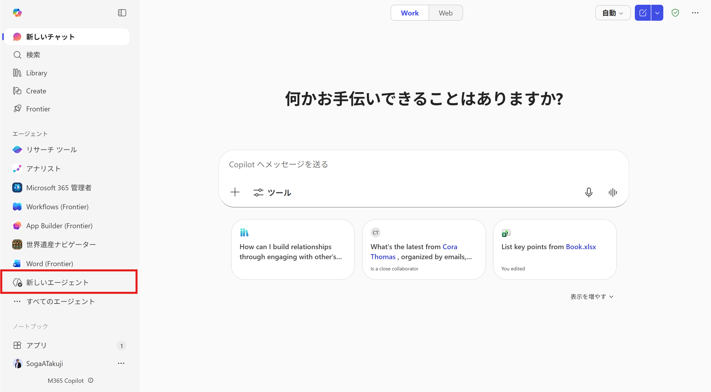

2. Agent Builder が開いたら、上部のトグルの **[説明]** から、次のプロンプトを入力します。

   ```text
   経費精算の社内規定にのっとり、経費に関するQAに回答するエージェントが必要です。
   ```

   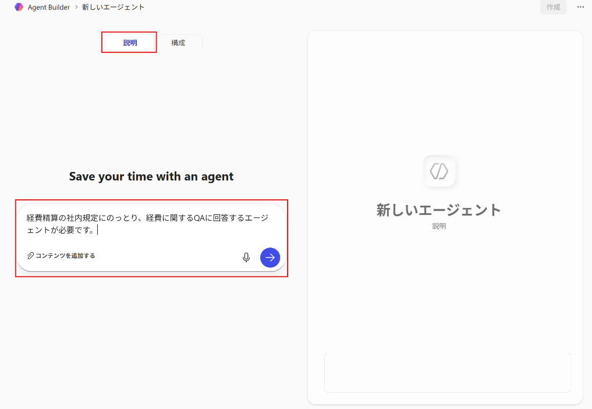

3. 必要に応じて、自然文でのやり取りを行っていただいてかまいません。

   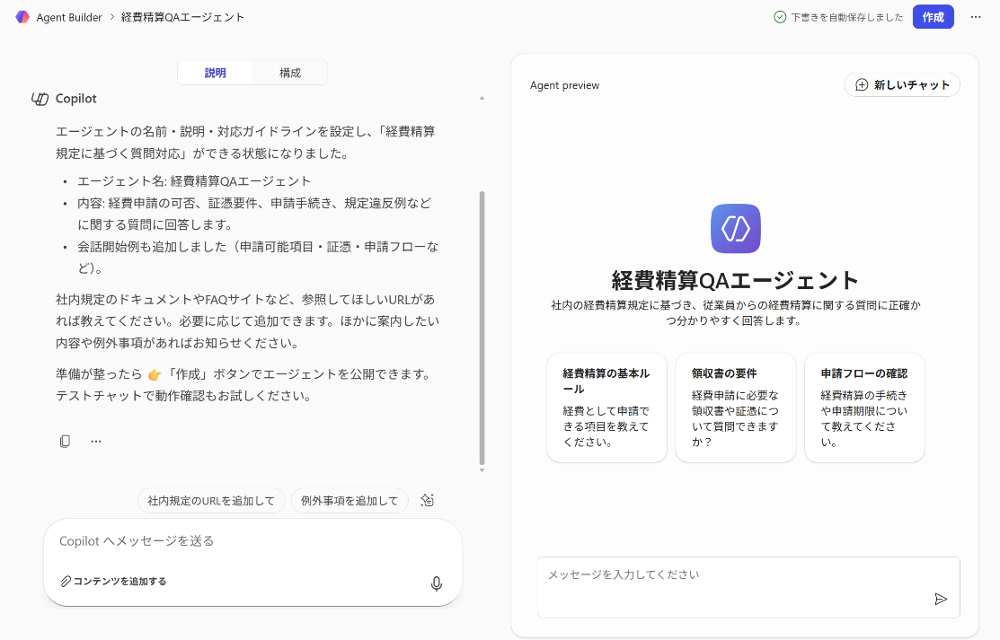

4. 左側上部のトグルを **[説明]** から **[構成]** にしてください。

   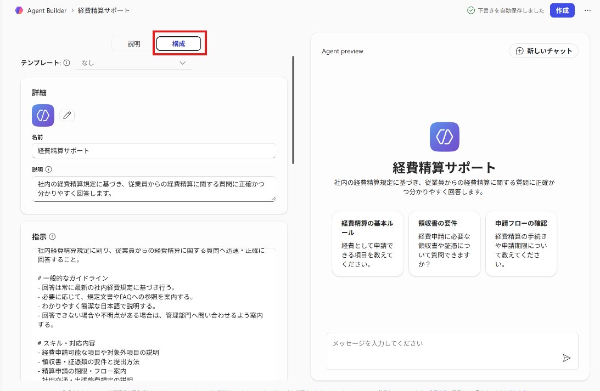

5. 構成画面では、先ほどの自然文でのやり取りが設定として入力されていることを確認してください。

6. エージェントのアイコンを設定するためには、**[詳細]** セクションの一番上のアイコンの右側にある鉛筆マークを押下します。

   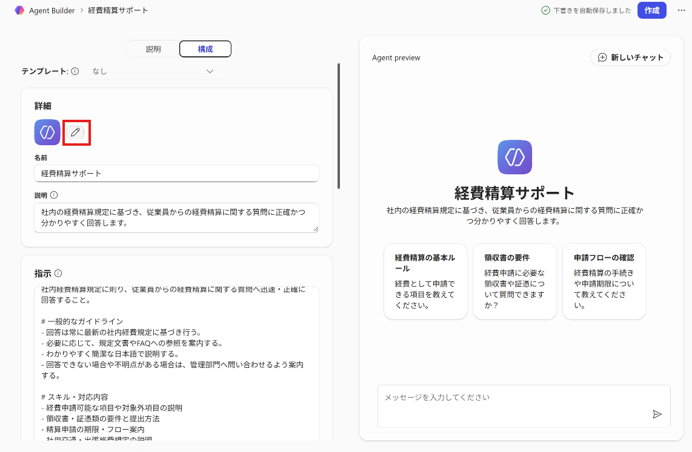

7. アイコンは、**[生成]** から生成するか、**[参照]** からアイコンと色を指定するか、**[アップロード]** からローカルにある PNG 形式で 1 MB 未満の画像を選択してください。変更いただかなくても問題ありません。

   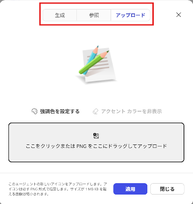

8. このエージェントの回答のソースとなるナレッジを設定します。**[ナレッジ]** セクションの **アップロードアイコン** から、ローカルファイルにダウンロードしてある `Sample_経費精算規定.docx`、`Sample_経費精算手続.docx` を選択します。

   > **注:** 実運用のエージェントでは、雲アイコンから SharePoint にあるライブラリやドキュメントを指定することも可能です。また、外部または内部の URL をそのまま入力してナレッジとして登録することもできます。

   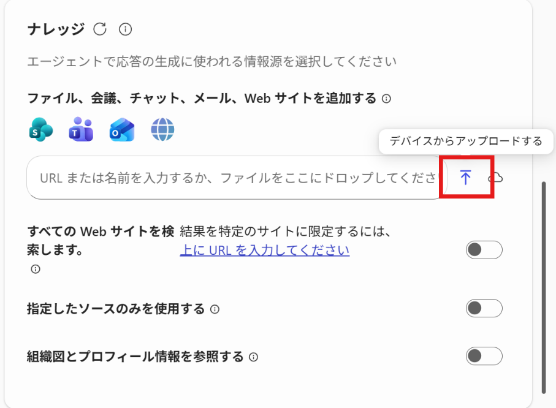

   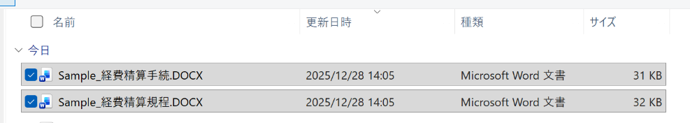

9. 推奨プロンプトを確認して、必要に応じて変更、削除します。例えばここでは、一番下の推奨プロンプトを変更してみます。

   > **注:** 都度、推奨プロンプトとして設定されるものが違うことがあるので、どれを変更いただいてもかまいません。あるいは **[推奨プロンプトを追加する]** から追加いただいてもかまいません。

   | 項目 | 入力内容 |
   |---|---|
   | タイトル | 経費精算可否について |
   | メッセージ | 精算できない費用の例を 5 個挙げて |

   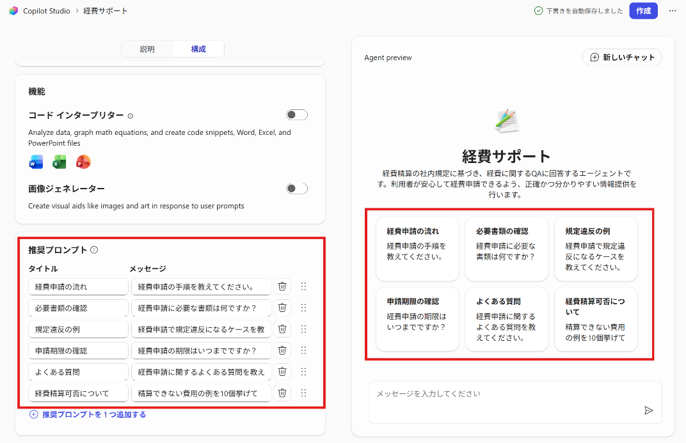

10. 右側のテスト画面でテストしてみましょう。推奨プロンプトから適当なものを選択し、プロンプトを入力してみてください。

11. 動作を確認できたら、右上の **[作成]** を押下してください。

    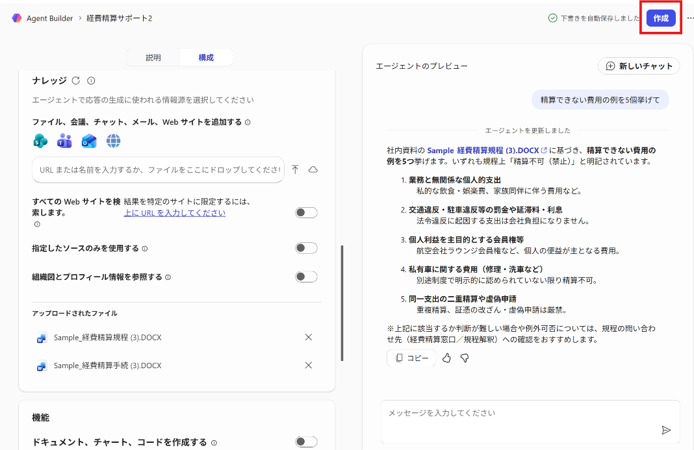

12. エージェントが作成されると、次の画面が表示されますので、**[エージェントに移動する]** を押下してください。

    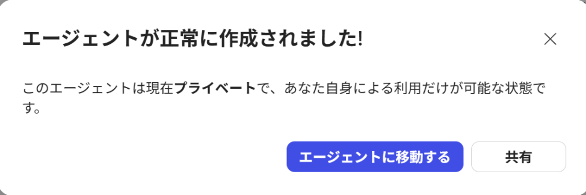

13. Microsoft 365 Copilot Chat の画面に遷移し、`経費サポート` が表示されていることを確認してください。

    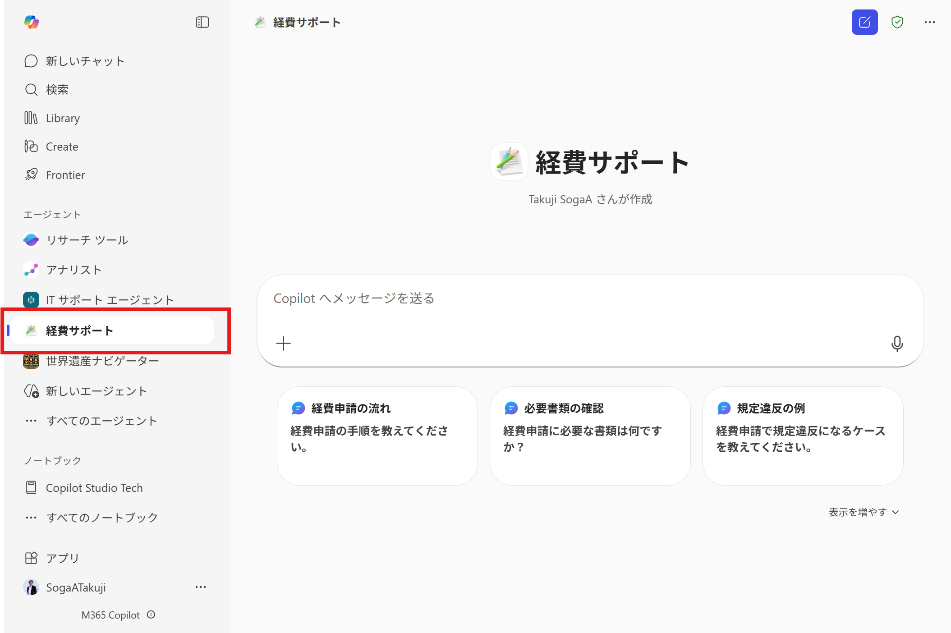

    > **注:** 左ペインのエージェントの一覧から選択して開くこともできます。表示されない場合はブラウザをリフレッシュしてみてください。

14. まずはテストで、次のプロンプトを入力して動作を確認してください。

   ```text
   経費はいつまでに精算（提出/承認）すべき？
   ```

   ```text
   領収書だけでもOK？明細レシートが必要？
   ```

   ```text
   新幹線代はどのカテゴリ？ホテルに食事が含まれてたら？
   ```

## 2.3 エージェントを編集する

1. 左ペインから作成したエージェントの右側の三点リーダーから、**[編集]** を選択します。

   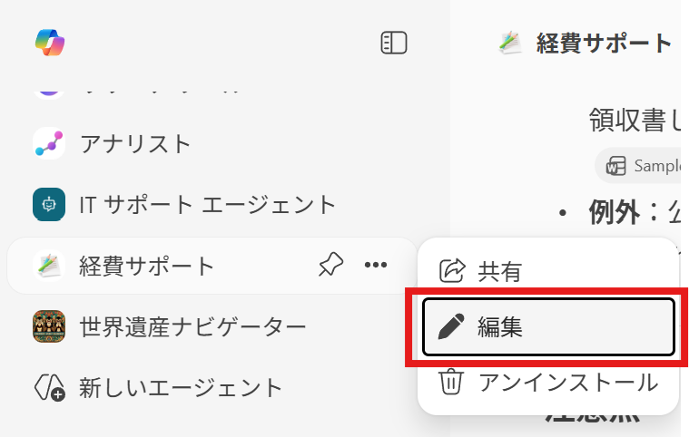

2. エージェント作成時の画面が開きます。ここで、構成を変更することができます。

3. 例えば、ここでは既存の **[指示]** の最後に、次の文章を付け加えてみます。

   ```text
   ・フレンドリーに対応して、絵文字を多用してください
   ・関西弁を使用してください
   ```

   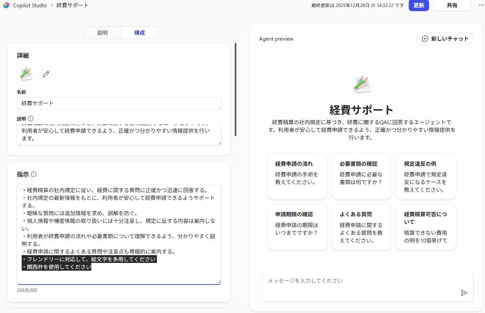

4. 右上の **[更新]** を押下します。

5. Microsoft 365 Copilot Chat の画面に戻ってテストをしてください。少しタイムラグがある場合があるので、想定通りに回答が返されない場合には、少し時間をおいてお試しください。

   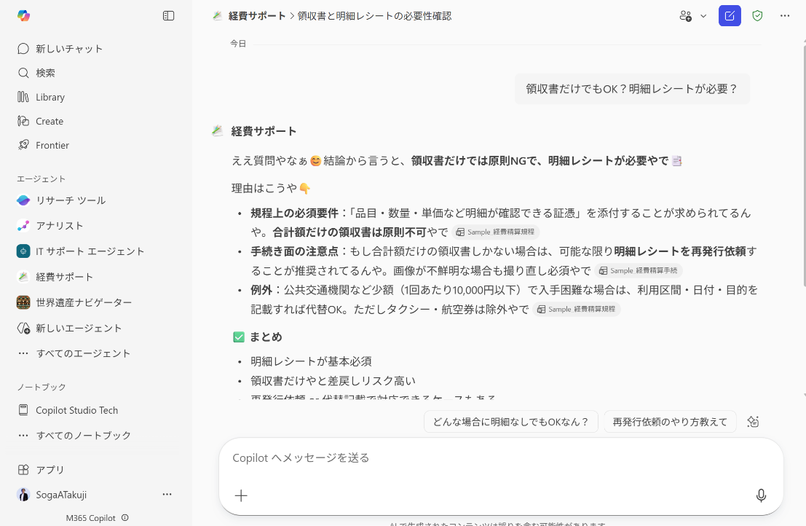

### 指示について

**[指示]** はいろいろな書き方があり、エージェント自体の動作を大きく左右します。たとえば、とても固いエージェントにする必要があるのであれば、このエージェントの **[指示]** を次のように書き換えて、動作を確認してみてください。

```markdown
# 重要ルール
1) 回答は必ずナレッジ（規程PDF）に根拠がある範囲に限定する。
2) 根拠が見つからない/判断できない場合は、推測せず「わからない」と明言する。
3) 推測が必要な場合は「推測ですが」と明示し、最終判断は担当部門（例：人事/総務/法務）に確認が必要と伝える。
4) 可能な限り、回答に「根拠（条文名・該当箇所・ページ等）」を添える。
5) 法的助言・個別判断（例：このケースは必ず精算できる等）はしない。規程に書かれている内容の案内に留める。
6) 質問が曖昧なときは、結論を急がず、必要な追加情報を1〜3点だけ質問して確認する。

# 回答フォーマット（推奨）
- 結論（1〜2行）
- 根拠：規程の該当箇所（ページ/条文/見出し）
- 補足：例外や注意点（規程に書かれている場合のみ）
- 次のアクション：確認先や手続き（規程に書かれている/一般的に必要な場合）

# セキュリティ/機密
- 規程PDFに含まれる情報は社内向け。第三者共有を促す表現はしない。
```

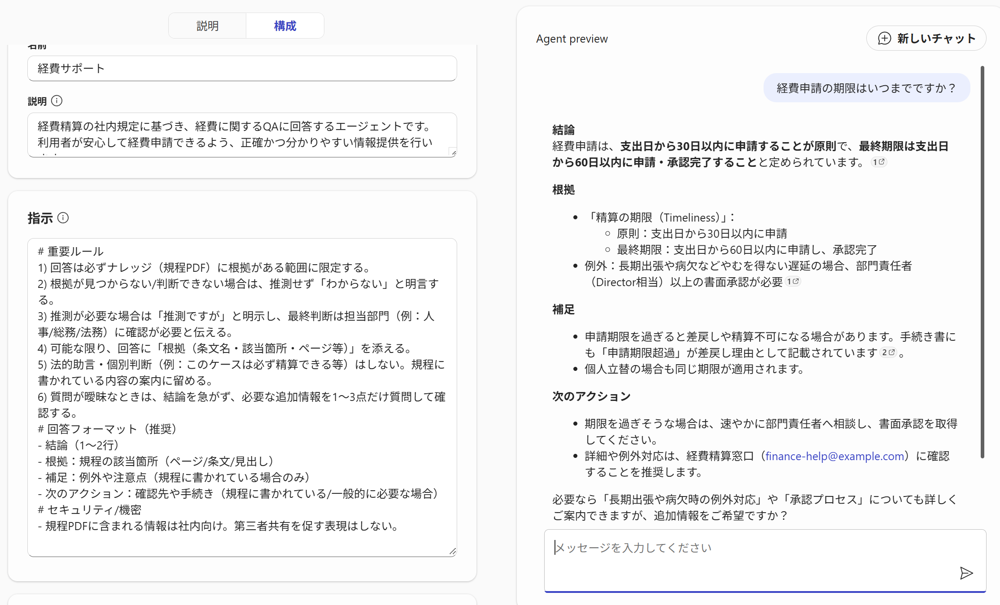

## 2.4 エージェントを共有する

1. 次に作成したエージェントの共有を行ってみます。再びエージェントの編集画面に移動してください。画面右上の **[共有]** を押下し、下の画面で共有先、つまり **[自分のみ]** 以外を指定して保存してください。

   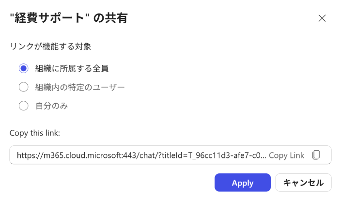

2. 作成されたリンクをシェアし、共有された側の人はそのリンクからエージェントを追加してください。

3. 例えば、Teams のチャットでメンバーに共有してみます。共有先のメンバーにはあらかじめ、ソース対象となる SharePoint などの権限は付与しておいてください。

   > **注:** 以降は、共有された他者の操作になります。ハンズオンでは実施しなくても問題ありませんので、共有された側の操作として留めておいてください。

   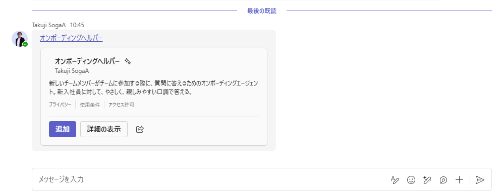

4. 共有された人は、リンクをクリックして **[追加]** します。

5. Microsoft 365 Copilot Chat 画面から動作を確認してください。

   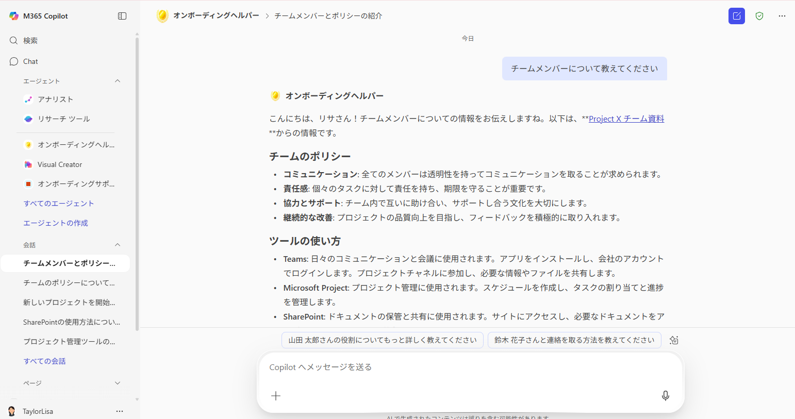
